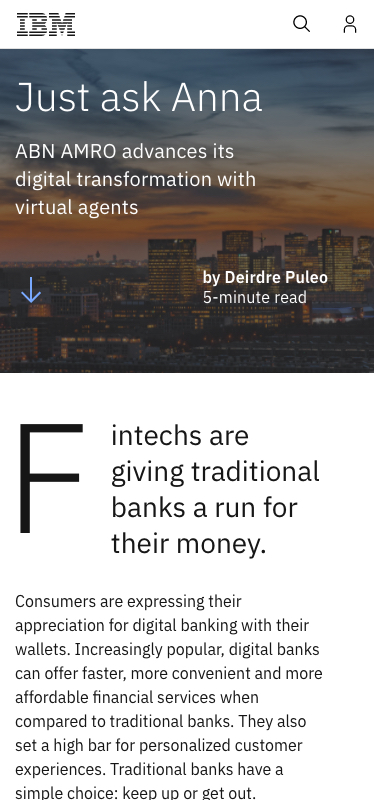

# Procesverslag
Markdown is een simpele manier om HTML te schrijven.  
Markdown cheat cheet: [Hulp bij het schrijven van Markdown](https://github.com/adam-p/markdown-here/wiki/Markdown-Cheatsheet).

Nb. De standaardstructuur en de spartaanse opmaak van de README.md zijn helemaal prima. Het gaat om de inhoud van je procesverslag. Besteedt de tijd voor pracht en praal aan je website.

Nb. Door *open* toe te voegen aan een *details* element kun je deze standaard open zetten. Fijn om dat steeds voor de relevante stuk(ken) te doen.

## Jij

uitwerken voor kick-off werkgroep

### Auteur:
Alex Lanting

#### Je startniveau:
Rode piste

#### Je focus:
Responsive (Surface)
 

## Je website

uitwerken voor kick-off werkgroep

### Je opdracht:
https://www.ibm.com/

#### Screenshot(s) van de eerste pagina (small screen): 
IBM Homepage  

#### Screenshot(s) van de tweede pagina (small screen):
IBM artikel pagina  

 

## Breakdownschets (week 1)

uitwerken na afloop 2e werkgroep

### de hele pagina: 

### dynamisch: 

## Voortgang 1 (week 2)

uitwerken voor 1e voortgang

### Stand van zaken
hier dit ging goed & dit was lastig (neem ook screenshots op van delen van je website en code), 
Ik vond het beginnen met github wel even wennen maar vind het nu wel fijn werken. Verder had ik moeite met de css selectoren, ik heb vaak dat ik meerdere html elementen aanspreek terwijl ik er maar 1 aan wil spreken. 

### Agenda voor meeting
samen met je groepje opstellen

<table>
  <tr>
    <th>Alex</th>
    <th>Martin</th>
    <th>Dave</th>
    <th>Ruben</th>
  </tr>
  <tr>
    <td>CSS selectoren</td>
    <td></td>
    <td></td>
    <td></td>
  </tr>
</table>

### Verslag van meeting
hier na afloop snel de uitkomsten van de meeting vastleggen

- Meer root kleuren toevoegen
- H1, H2, H3, P allemaal aanspreken met 1 root kleur (effiecientie) 
- Los de CSS selector problemen op met gebruik van "+ > ~" 
- IBM logo in nav kan een H1 zijn 

## Voortgang 2 (week 3)

uitwerken voor 2e voortgang

### Stand van zaken
hier dit ging goed & dit was lastig (neem ook screenshots op van delen van je website en code), Het coderen van alle onderdelen op mijn website is goed gelukt. Ik had alleen een probleem met een opacity toepassen op een background image zonder dat de tekst ook aangepast word. 

### Agenda voor meeting
samen met je groepje opstellen

<table>
  <tr>
    <th>Alex</th>
    <th>Martin</th>
    <th>Dave</th>
    <th>Ruben</th>
  </tr>
  <tr>
    <td>Image styling</td>
    <td>Backdrop filter</td>
    <td></td>
    <td></td>
  </tr>
</table>

### Verslag van meeting
hier na afloop snel de uitkomsten van de meeting vastleggen

- Hamburger menu animatie toevoegen
- Button animaties
- Maak 2e pagina
- Maak de carousel werkend 

## Toegankelijkheidstest (week 4)

uitwerken na test in 8e voortgang

### Bevindingen
Lijst met je bevindingen die in de test naar voren kwamen:
- Logo kan je niet op klikken
- Niet alle linkjes zijn nog toegevoegd
- Alt op images met screenreader niet altijd heel duidelijk
- Met de schokken en motorische problemen was het lastig om de website te bedienen maar nog wel mogelijk
- De bril met suiker zieke was wel vervelend maar ik kon de website nog goed gebruiken
- Met elastiekjes om je vingers kan je nog wel typen maar gaat minder goed
- De ballon hoog houden terwijl je de website gebruikt is heel lastig, alles gaat heel sloom en je word constant afgeleid

 
#### Titel eerste bevinding
Hier korte omschrijving (met indien nodig een afbeelding)

Hier een omschrijving van hoe het opgelost kan worden (met indien nodig een afbeelding)

#### Titel tweede bevinding. 
Hier korte omschrijving (met indien nodig een afbeelding)

Hier een omschrijving van hoe het opgelost kan worden (met indien nodig een afbeelding)

#### Titel volgende bevinding. 
Hier korte omschrijving (met indien nodig een afbeelding)

Hier een omschrijving van hoe het opgelost kan worden (met indien nodig een afbeelding)

#### Titel nog een bevinding. 
Hier korte omschrijving (met indien nodig een afbeelding)

Hier een omschrijving van hoe het opgelost kan worden (met indien nodig een afbeelding)

## Voortgang 3 (week 4)

uitwerken voor 3e voortgang

### Stand van zaken
hier dit ging goed & dit was lastig (neem ook screenshots op van delen van je website en code)

### Agenda voor meeting
samen met je groepje opstellen

| student 1      | student 2          | student 3    | student 4        |
| ---            | ---                | ---          | ---              |
| dit bespreken  | en dit             | en ik dit    | en dan ik dat    |
| en dat ook nog | dit als er tijd is | nog een punt | dit wil ik zeker |
| ...            | ...                | ...          | ...              |

### Verslag van meeting
hier na afloop snel de uitkomsten van de meeting vastleggen

- punt 1
- punt 2
- nog een punt
- ...

## Eindgesprek (week 5)

uitwerken voor eindgesprek

### Stand van zaken
hier dit ging goed & dit was lastig (neem ook screenshots op van delen van je website en code)

### Screenshot(s)

hier screenshot(s) van je eindresultaat

## Bronnenlijst

continu bijhouden terwijl je werkt

Nb. Wees specifiek ('css-tricks' als bron is bijv. niet specifiek genoeg).

1. https://www.ibm.com/nl-en (Nagemaakte website) 
2. https://flukeout.github.io/# (oefening voor css selectors)
3. https://unsplash.com/ (all photos are free to use) 

